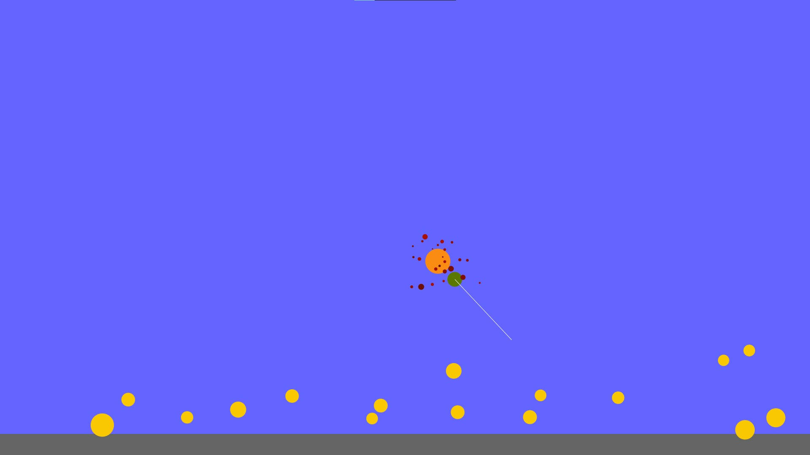

# Ball-Bounce-Processing
Shoot balls and watch them bounce.

## Prerequisite
1. [Processing 3](https://processing.org/)

## Running
1. Open `main/main.pde` using Processing
2. Press Run or `ctrl+R`

## How to Play
- Drag and hold mouse to aim
- Release to shoot balls

## Acknowledgement
It's me messing up with my own "physics engine".

Yes, they bounce indefinitely.
